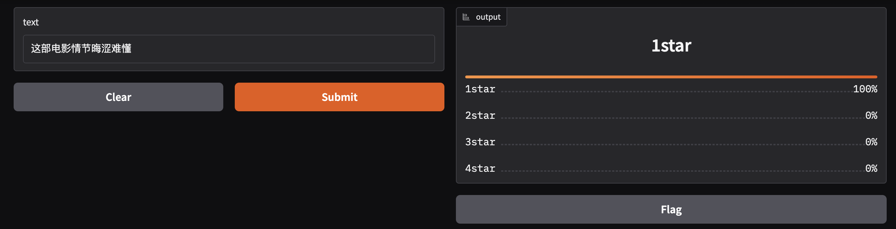
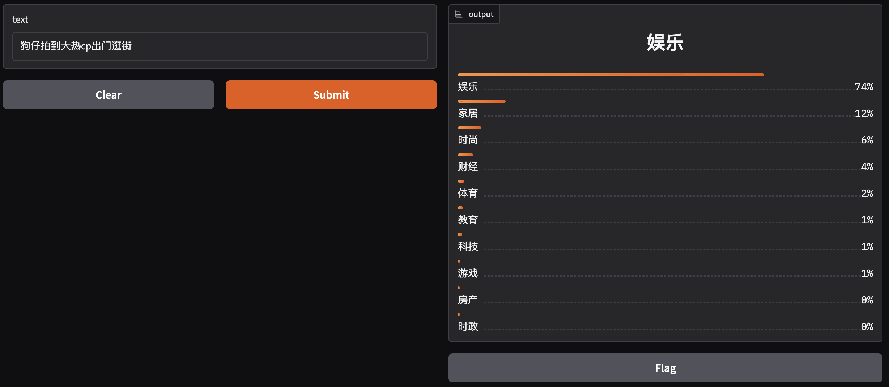

# BERT_CLS
## 首先是使用豆瓣数据集进行电影评论评分分类
使用收集完 清理好的豆瓣电影评论数据进行训练，最后使用gradio进行简单部署
## 其次是使用清华大学的cnews数据，本次训练模型所用的数据训练集10000条，验证集合10000条（计算资源限制原因）
可在阿里的天池平台进行数据集的下载
## 训练操作
- 豆瓣：终端执行 python douban_train.py
- cnews: 终端执行 python cnews_train.py
## 部署操作
- 豆瓣：终端执行 python douban_deploy.py
- cnews：终端执行 python cnews_deploy.py
## 部署界面如下图所示
- 电影评论得分：
- cnews新闻分类：
## 数据链接：
cnews：https://tianchi.aliyun.com/dataset/119797
